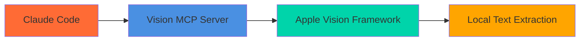

# Vision MCP Server

[](https://www.npmjs.com/package/@tuannvm/vision-mcp-server)
[](https://www.npmjs.com/package/@tuannvm/vision-mcp-server)

Local-only OCR MCP server using Apple Vision Framework. Fully offline, privacy-focused text extraction from images directly in Claude Code.



## Quick Start

### 1. Install the Server

```bash
claude mcp add local-ocr -- npx -y @tuannvm/vision-mcp-server
```

### 2. Start Using

```
Extract the text from this image
Extract Chinese text using fast recognition
```

## One-Click Install

[](https://vscode.dev/redirect/mcp/install?name=local-ocr&config=%7B%22type%22%3A%22stdio%22%2C%22command%22%3A%22npx%22%2C%22args%22%3A%5B%22-y%22%2C%22%40tuannvm%2Fvision-mcp-server%22%5D%7D)
[](https://insiders.vscode.dev/redirect/mcp/install?name=local-ocr&config=%7B%22type%22%3A%22stdio%22%2C%22command%22%3A%22npx%22%2C%22args%22%3A%5B%22-y%22%2C%22%40tuannvm%2Fvision-mcp-server%22%5D%7D)
[](https://cursor.com/en/install-mcp?name=local-ocr&config=eyJ0eXBlIjoic3RkaW8iLCJjb21tYW5kIjoibnB4IC15IEB0dWFubnZtL3Zpc2lvbi1tY3Atc2VydmVyIiwiZW52Ijp7fX0%3D)

## Tools

| Tool | Description |
|------|-------------|
| `ocr_extract_text` | Extract text from images using Apple Vision Framework |

## Examples

The tool automatically detects the input format:

**Pasted Images (Base64):**
```
Extract the text from this image
```
When you paste an image in Claude Code, it's automatically converted to base64 format.

**Local File Paths:**
```
Read text from /Users/username/Desktop/screenshot.png
Extract text from ~/Downloads/receipt.jpg
```

**Remote URLs:**
```
Extract text from https://example.com/screenshot.jpg
OCR the image at https://example.org/photo.png
```

**Multi-language extraction:**
```
Extract Chinese and Japanese text from this screenshot
```

**Fast recognition mode:**
```
Extract text using fast recognition mode
```

**Advanced options:**
```
Extract text with recognition level "fast" and language correction disabled
```

## Requirements

- **macOS 13.0+** — Apple Vision Framework is built into macOS
- **Node.js 18+** — Required for MCP server runtime
- **Apple Silicon or Intel** — Both arm64 and x64 are supported

## Supported Languages

`en-US`, `zh-Hans`, `zh-Hant`, `ja`, `ko`, `es`, `fr`, `de`, `it`, `pt-BR`, `ru`, `ar`, `th`, `vi`, `nl`, `pl`, `tr`

[Full language list](https://developer.apple.com/documentation/vision/vnrecognizetextrequest/3600635-recognitionlanguages)

## Documentation

- **[API Reference](docs/api-reference.md)** — Full tool parameters and response formats
- **[Architecture](docs/architecture.md)** — Technical design details

## Development

```bash
npm install         # Install dependencies
npm run build       # Build Swift binary
npm run build:release  # Build optimized release binary
npm test            # Run tests
```

## Related Projects

- **[codex-mcp-server](https://github.com/tuannvm/codex-mcp-server)** — MCP server for OpenAI Codex CLI with AI-powered code analysis and review
- **[gemini-mcp-server](https://github.com/tuannvm/gemini-mcp-server)** — MCP server for Gemini CLI with 1M+ token context, web search, and media analysis

## License

MIT
